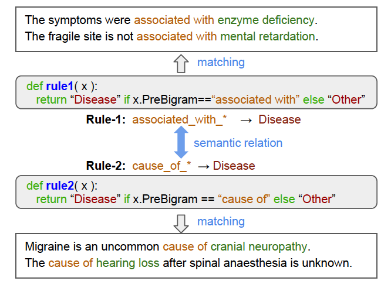
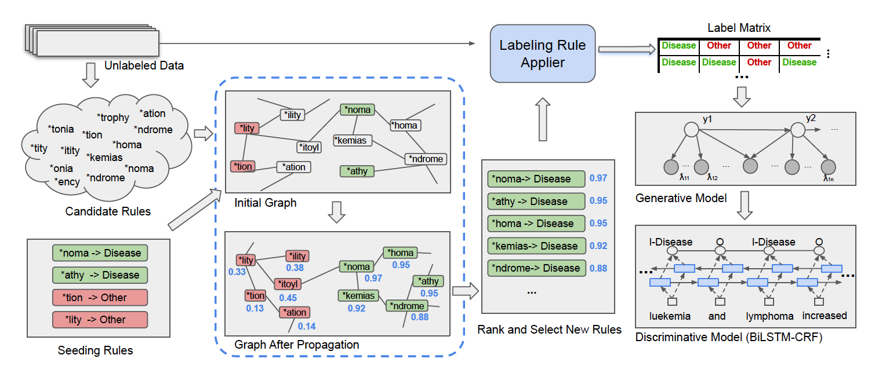

# GLaRA: Graph-based Labeling Rule Augmentation for Weakly Supervised Named Entity Recognition

This paper is the code release of the paper [GLaRA: Graph-based Labeling Rule Augmentation for Weakly Supervised Named Entity Recognition] (https://github.com/zhaoxy92/GLaRA), which is accepted at EACL-2021.

This work aims at improving weakly supervised named entity reconigtion systems by automatically finding new rules that are helpful at identifying entities from data. The idea is, as shown in the following figure, if we know ***rule1: associated with->Disease*** is an accurate rule and it is semantically related to ***rule2: cause of->Disease***, we should be able use ***rule2*** as another accurate rule for identifying Disease entities.

The overall workflow is illustrated as below:

For a specific type of rules, we frist extract a large set of possible rule candidates from unlabeled data. Then the rule candidates are constructed into a graph where each node represents a candidate and edges are built based on the semantic similarties of the node pairs. Next, by manually identifying a small set of nodes as seeding rules, we use a graph-based neural network to find new rules by propaging the labeling confidence from seeding rules to other candidates. Finally, with the newly learned rules, we follow weak supervision to create weakly labeled dataset by creating a labeling matrix on unlabeled data and training a generative model. Finally, we train our final NER system with a discriminative model.

## Installation

1. Install required libraries
  - Install LinkedHMM by running `pip -r requirements.txt` in command line.
  - Install Pytorch at https://pytorch.org/
  - Install Transformers at https://huggingface.co/transformers/installation.html
  - Install pytorch-geometric at https://pytorch-geometric.readthedocs.io/en/latest/notes/installation.html

2. Download dataset
    - Once LinkedHMM is successfully installed, move all the files in "data" fold under LinkedHMM directory to the "datasets" folder in the currect directory.
    - Download pretrained sciBERT embeddings here: https://huggingface.co/allenai/scibert_scivocab_uncased, and move it to the folder `pretrained-model`.
  - For saving the time of reading data, we cache all datasets into picked objects: `python cache_datasets.py` 

## Run experiments
The experiments on the three data sets are independently conducted. To run experiments for one task, (i.e NCBI), please go to folder `code-NCBI`. For the experiments on other datasets, namely BC5CDR and LaptopReview, please go to folder `code-BC5CDR` and `code-LaptopReview` and run the same commands. 

1. Extract candidate rules for each type and cache embeddings, edges, seeds, etc.
  - run `python prepare_candidates_and_embeddings.py --dataset NCBI --rule_type SurfaceForm` to cache candidate rules, embeddings, edges, etc., for `SurfaceForm` rule.
  - other rule types are `Suffix`, `Prefix`, `InclusivePreNgram`, `ExclusivePreNgram`, `InclusivePostNgram`, `ExclusivePostNgram`, and `Dependency`.
  - all cached data will be save into the folder `cached_seeds_and_embeddings`.

2. Train propogation and find new rules.
  - run `python propagate.py --dataset NCBI --rule_type SurfaceForm` to learn `SurfaceForm` rules. 
  - other rules are `Suffix`, `Prefix`, `InclusivePreNgram`, `ExclusivePreNgram`, `InclusivePostNgram`, `ExclusivePostNgram`, and `Dependency`.
 
3. Train LinkedHMM generative model
  - run `python train_generative_model.py --dataset NCBI --use_SurfaceForm --use_Suffix --use_Prefix --use_InclusivePostNgram --use_Dependency`.
  - The argument `--use_[TYPE]` is used to activate a specific type of rules.
  
4. Train discriminative model
  - run `create_dataset_for_bert_tagger.py` to prepare dataset for training the tagging model. (make sure to change the `dataset` and `data_name` variables in the file first.)
  - run `train_discriminative_model.py`
